## AWS_Transit_gateway

By following steps we are going to create a transit gateway to connect multiple VPC in the same or multiple aws account without vpc peering.
  

  

To create TG, I will create 3 VPCs and 3 ec2 instances 1 in each VPC to check.
  
Step 1: Create VPC Test-TG1, Test-TG12 and Test-TG3 with CIDR 10.1.1.0/24, 10.1.2.0/24 and 10.1.3.0/24 respectively.
  

  
Step 2: Now create a subnet for each VPCs, Create 1 public and 1 private subnet in each subnet. I used subnetting to divide CIDR into subnets like 10.1.1.0/25(public)  and 10.1.1.128/25(private).
  
Step 3: Now create an internet gateway for each VPC, To access ec2 instances now create an internet gateway and attach it to each VPC respectively.
  
Step 4: Now create 1 EC2 instance in each VPC to check connectivity between servers in different VPC. I have created 2 EC2 (VPC1 & VPC2) in public and 1 EC2 (VPC3) in private to check private subnet ec2 is also accessible from public subnet in different VPC. 
  
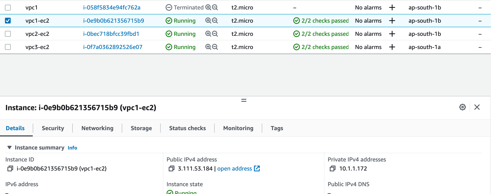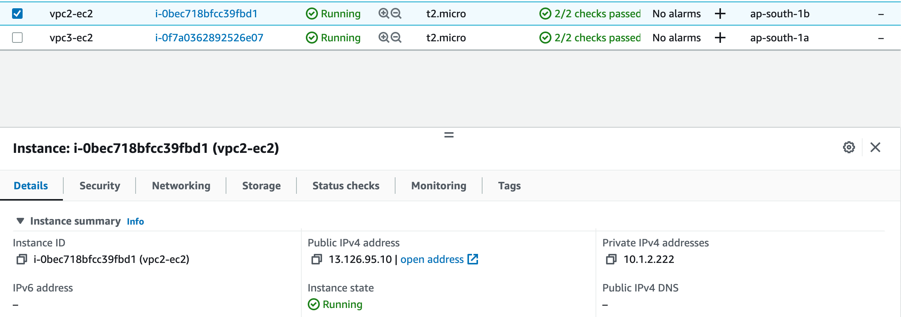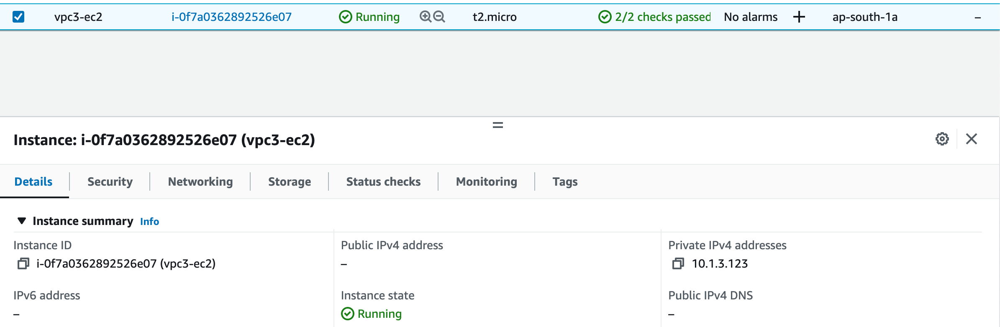
  
Step 5: Now login to each server and check connectivity by using the ping command. I did it from VPC1 EC2 and got the following response.
  
Note: You need to allow Custom-ICMP for ping in your security group to check ping response. To enable ICMP protocol (ping response) follow below steps.

Go to EC2 Dashboard and click "Running Instances"

on "Security Groups", select the group of your instance which you need to add security.

click on the "Inbound" tab

Click "Edit" Button (It will open a popup window)

click "Add Rule"

Select the "Custom ICMP rule - IPv4" as Type

Select "Echo Request" as the Protocol (Port Range by default show as "N/A)

Enter the "0.0.0.0/0" as Source

Click "Save"

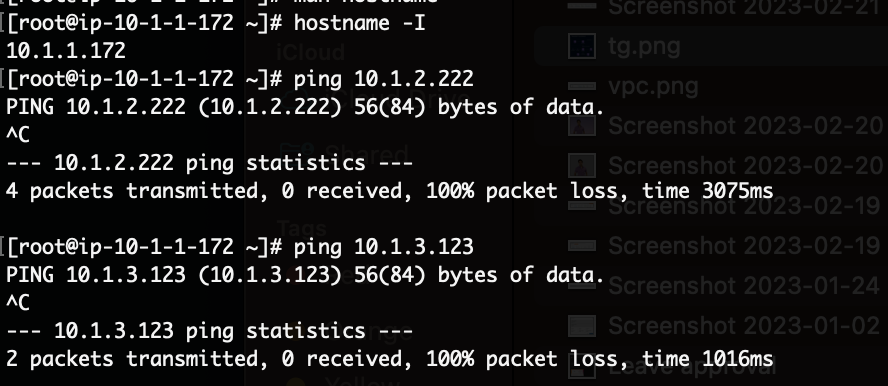

  
Now we need to create a Transit Gateway and Transit Gateway Attachment to Solve this problem. Once we will create TG and TG attachment TG route tables will be created automatically with association and propagation for all 3 VPCs.   
  
Step 6: To create TG go to VPC services, select Transit gateways and inside it create transit gateway. Now provide details as showing in below images.
  
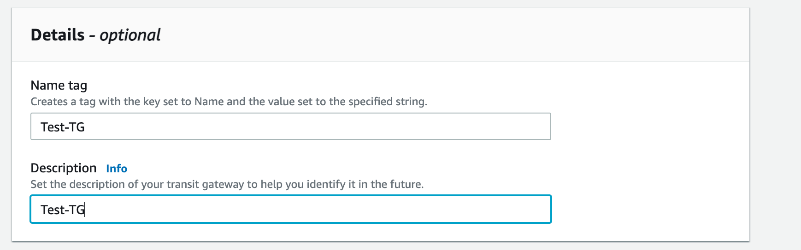
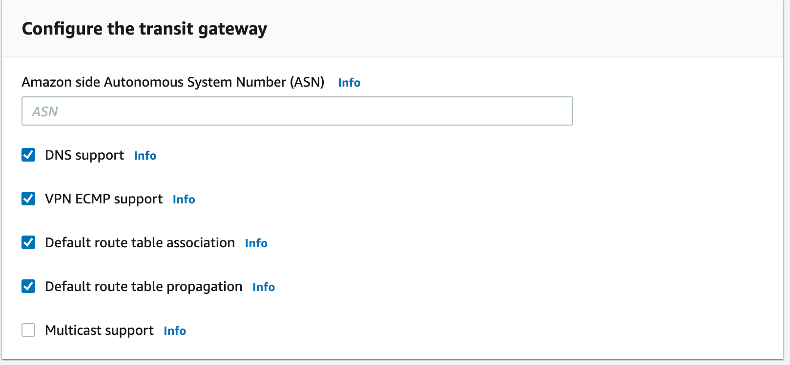
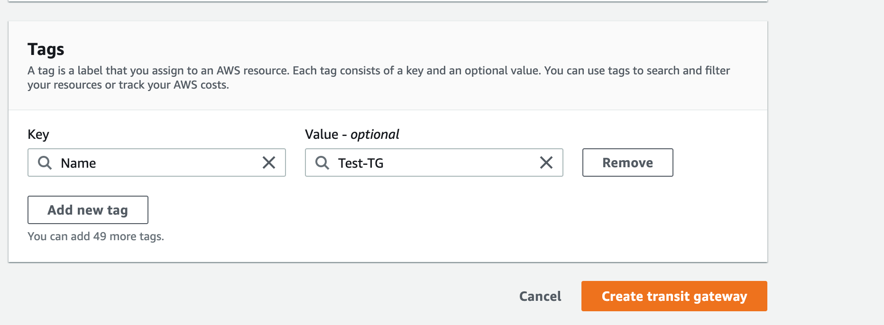

  
Step 7: Now create TG Attachment for each VPC as below. 
  
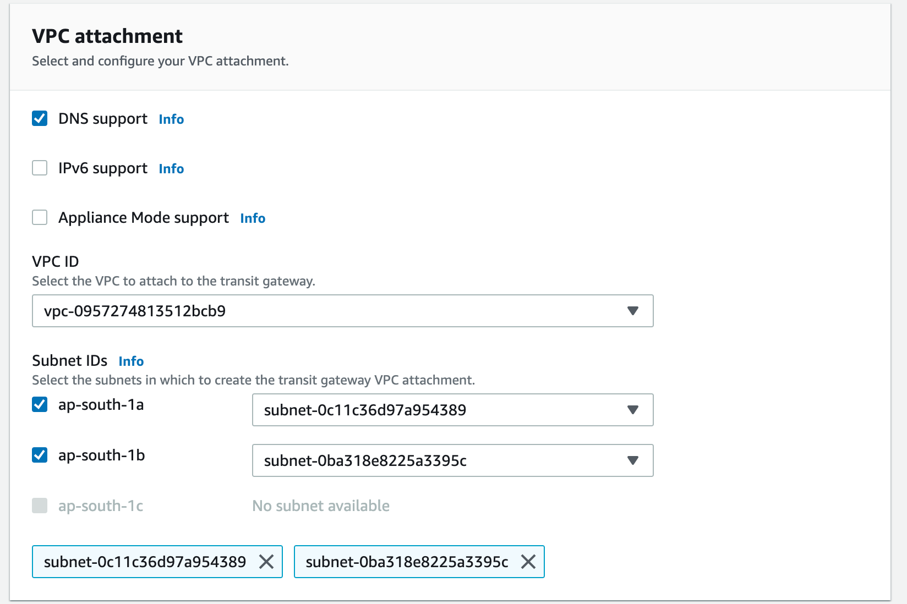
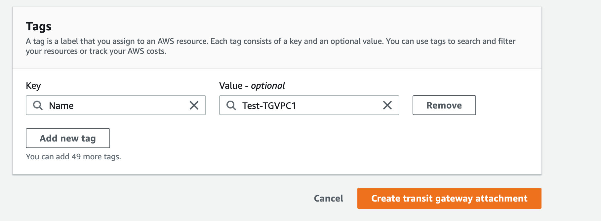
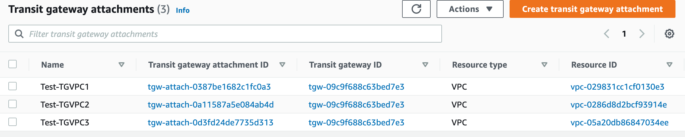
  
Step 8: Once all TG attachments created successfully check the TG Route table, It will show all VPC in association and propagation.
  
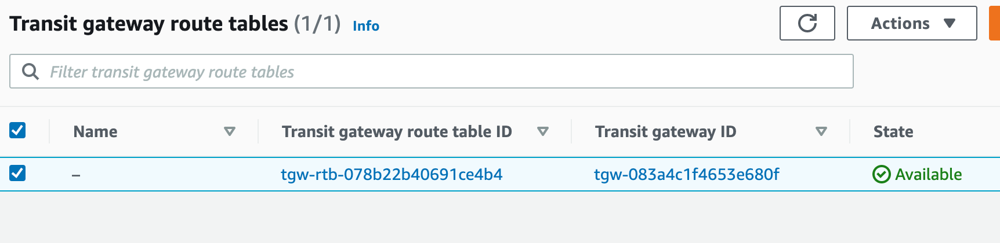
  
Step 9: Now add Transit Gateway in each VPC route table against other VPC CIDR. 

Like - 10.1.2.0/24 tgw-09c9f688c63bed7e3	and 10.1.3.0/24 tgw-09c9f688c63bed7e3 for VPC1 10.1.1.0/24

  
Step 10: Now your EC2 is ready to check connectivity with other VPC EC2 instances. You can also check with ssh for the same you need to allow ssh port in Security Group.
  

 From VPC1 ec2 to VPC2 and VPC3 ec2

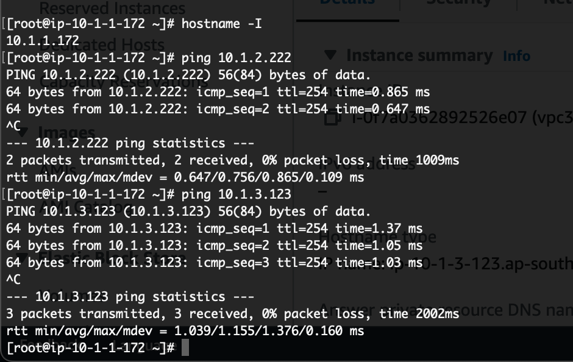
  

 From VPC2 ec2 to VPC1 and VPC3 ec2

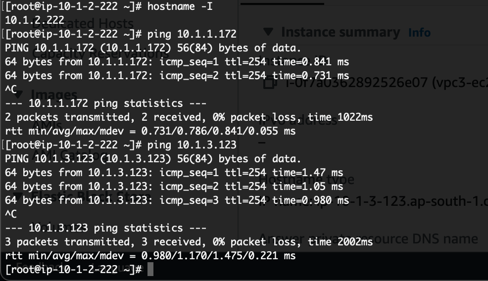
  

