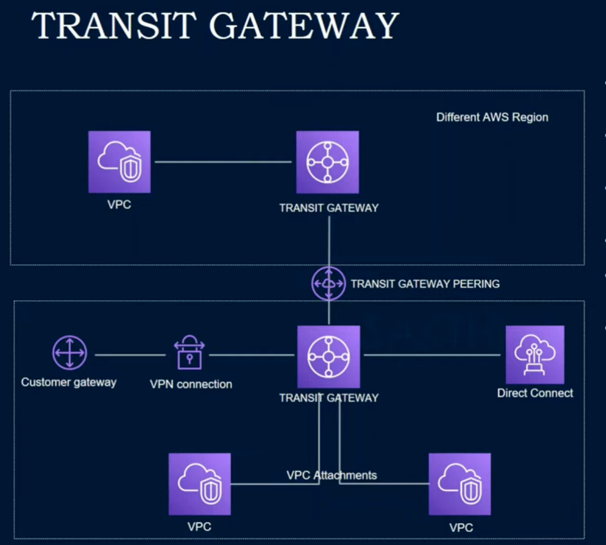
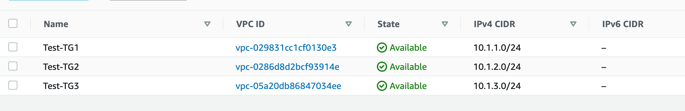

## AWS_Transit_gateway

By following steps we are going to create transit gateway to connect multiple vpc in same or multiple aws account without vpc peering.
  

  

To create TG, I will create 3 vpc and 3 ec2 instances 1 in each vpc to check.
  
Step 1: Crate VPC Test-TG1, Test-TG12 and Test-TG3 with CIDER 10.1.1.0/24, 10.1.2.0/24 and 10.1.3.0/24 respectively.
  

  
Step2 2: 

